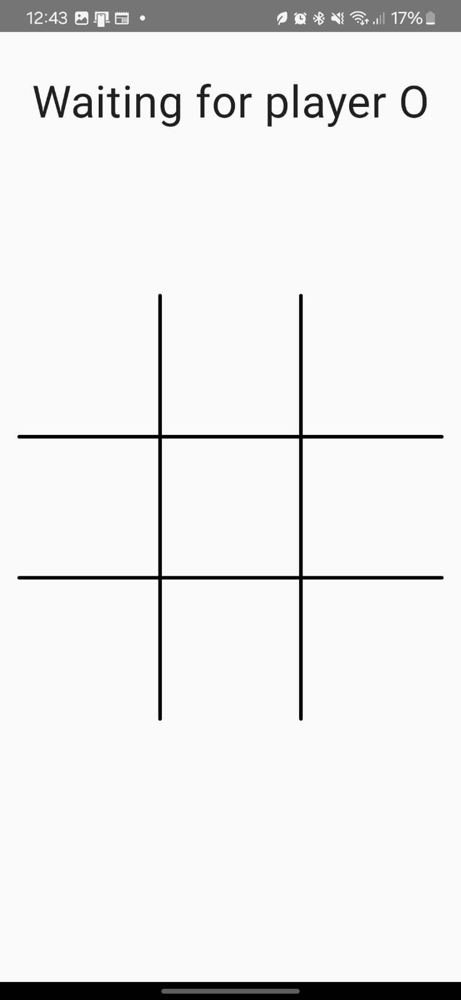
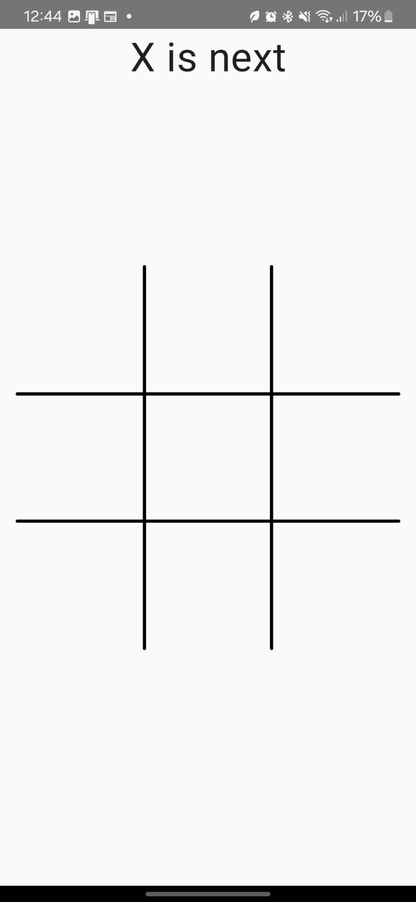
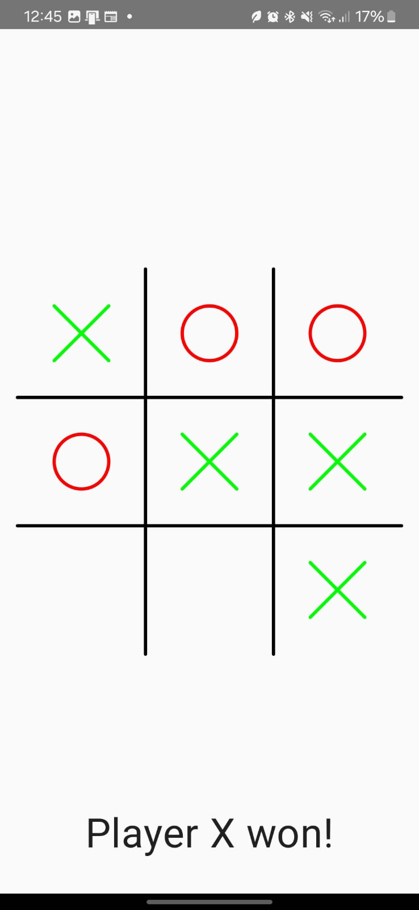

# 🎮 Kotlin Tic-Tac-Toe Online

> A complete real-time multiplayer Tic-Tac-Toe game built with Kotlin, featuring a Ktor backend and a native Android application with Jetpack Compose.

[](https://kotlinlang.org/)
[](https://developer.android.com/)
[](https://ktor.io/)
[](https://developer.android.com/jetpack/compose)

---

## 📸 Screenshots

<div align="center">
  <table>
    <tr>
      <td align="center">
        
        <br/>
        <strong>Waiting for Player</strong>
      </td>
      <td align="center">
        
        <br/>
        <strong>In-Game</strong>
      </td>
      <td align="center">
        
        <br/>
        <strong>Player X Wins</strong>
      </td>
      <td align="center">
        
        <br/>
        <strong>Connection Error</strong>
      </td>
    </tr>
  </table>
</div>

---

## 🏗️ Project Structure

```
📦 kotlin-tic-tac-toe-online
├── 📁 src/                          # Ktor Backend
│   ├── 📁 main/kotlin/example/com/
│   │   ├── 📄 Application.kt         # Main application entry point
│   │   ├── 📄 SocketRoute.kt         # WebSocket routing
│   │   ├── 📁 models/
│   │   │   ├── 📄 GameState.kt       # Game state management
│   │   │   ├── 📄 MakeTurn.kt        # Player action model
│   │   │   └── 📄 TicTacToeGame.kt    # Core game logic
│   │   └── 📁 plugins/               # Ktor plugins configuration
│   └── 📁 resources/                 # Configuration files
└── 📁 TicTacToeApp/                  # Android Application
    └── 📁 app/src/main/java/com/example/tictactoeonline/
        ├── 📄 MainActivity.kt        # Main activity
        ├── 📁 data/                  # Data layer
        ├── 📁 di/                    # Dependency injection
        ├── 📁 presentation/          # UI layer
        └── 📁 ui/theme/             # UI theming
```

---

## ✨ Features

### 🎯 Core Features
- **🌐 Real-time Multiplayer** - Play Tic-Tac-Toe with another player over the internet
- **⚡ WebSocket Communication** - Instant updates between Android app and backend
- **🔄 Automatic New Rounds** - Game resets automatically after completion
- **💉 Dependency Injection** - Well-structured architecture using Hilt

---

## 🛠️ Tech Stack

### 🖥️ Backend
| Technology | Purpose |
|------------|---------|
| **Ktor** | Web server and WebSocket handling |
| **Kotlin** | Primary programming language |
| **WebSockets** | Real-time bidirectional communication |
| **Kotlinx Serialization** | JSON serialization/deserialization |

### 📱 Android
| Technology | Purpose |
|------------|---------|
| **Kotlin** | Primary programming language |
| **Jetpack Compose** | Modern declarative UI framework |
| **State & ViewModel** | MVVM architecture and state management |
| **Hilt** | Dependency injection framework |
| **Ktor Client** | WebSocket client communication |

---

## 🚀 Getting Started

### 📋 Prerequisites

- **Java 8+** or **OpenJDK 8+**
- **Android Studio** (latest version)
- **Android SDK** (API level 21+)
- **Kotlin 1.8+**

### 🖥️ Backend Setup

1. **Clone the repository**
   ```bash
   git clone https://github.com/kevinfjq/kotlin-tictactoe.git
   cd kotlin-tic-tac-toe-online
   ```

2. **Open in your IDE**
   - Open the root directory in IntelliJ IDEA or your preferred Kotlin IDE

3. **Run the server**
   ```bash
   # Using Gradle
   # ./gradlew run

   # Or using your IDE
   # Navigate to src/main/kotlin/example/com/Application.kt
   # Run the main function
   ```
   
4. **Verify server is running**
   - Server will start on port `8080`
   - Look for console log messages confirming startup

### 📱 Android App Setup

1. **Update server IP address**
   ```kotlin
   // File: TicTacToeApp/app/src/main/java/com/example/tictactoeonline/data/KtorRealtimeMessagingClient.kt
   // Line: url("ws://192.168.0.6:8080/play")
   // Change to your machine's local IP address
   url("ws://YOUR_LOCAL_IP:8080/play")
   ```

2. **Open Android Studio**
   - Open the `TicTacToeApp` directory in Android Studio
   - Wait for Gradle sync to complete

3. **Run the app**
   - Connect an Android device or start an emulator
   - Click the "Run" button in Android Studio

4. **Test multiplayer**
   - Install the app on two different devices/emulators
   - Both players will automatically connect to start a game

---

## 🎮 How to Play

1. **🔗 Connect** - Launch the app on two devices
2. **⏳ Wait** - The first player becomes 'X', the second becomes 'O'
3. **🎯 Play** - Tap any empty cell to make your move
4. **🏆 Win** - Get three in a row (horizontal, vertical, or diagonal)
5. **🔄 Repeat** - Game automatically resets after 5 seconds
